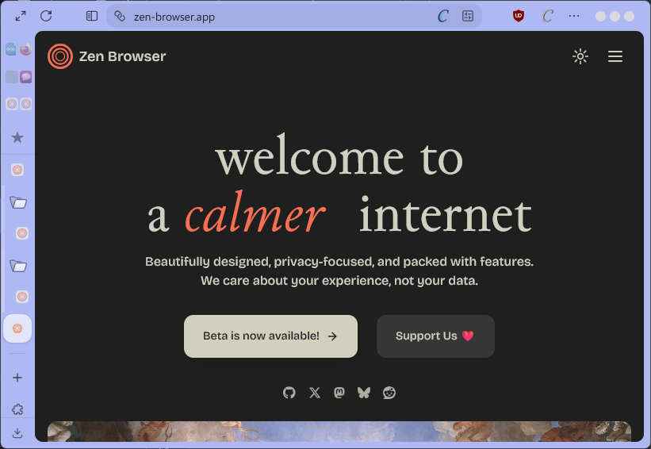
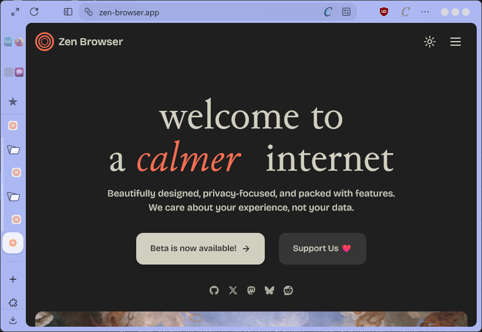
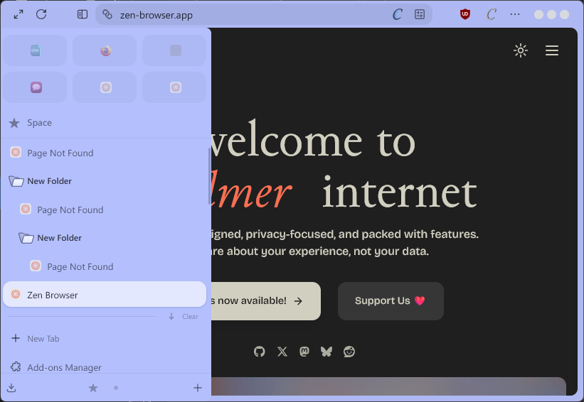

# Sidebar Expand on Hover

My personally (and actively!) maintained version of Sidebar Expand on Hover.

This fork fixes compatibility with newer Zen versions + a few of my own features added in.

### Highlights
- Fixed compatibility for Zen v1.17.11b! 
- Added: Collapsed Essentials, Collapsed Folders, etc.

<table>
  <tr>
    <td>
        
        
Compact Collapsed Essentials

    </td>
    <td>
        
        
Not-Compact Collapsed Essentials

    </td>
    <td>
        
        
Expanded Sidebar

    </td>
  </tr>
</table>

## To do
- [ ] Add configurable/revertable options
- [ ] Improve Animations (Essentials Animation between expanded/collapsed state)
- [x] Fix abrupt truncation on current tab indicator [Referenced from #76](https://github.com/Uiniel/zen-mods/issues/76#issuecomment-2884305863)
- [x] Hide scrollbar on collapsed sidebar [Referenced from #76](https://github.com/Uiniel/zen-mods/issues/76#issuecomment-2852383433)
- [ ] Add [Big Essentials Mod](https://zen-browser.app/mods/9bbaab67-a2c8-4d79-837f-90cd72a8932a/) support
- [ ] Fix window controls shifting to sidebar when tabs are placed on right
- [ ] Fix - Folder Search Popup: Sidebar collapses upon hovering over the popup
- [ ] Change navbar-toolbar padding to align with sidebar properly (Happens on varying var(--zen-element-separation) values)
- [ ] Fix - Only Sidebar layout support

## How to Download
### Download with Sine Mod Manager (Recommended)
Using Sine will allow this mod to be updated as this mod receives updates through github.

> Sine Mod Manager: <https://github.com/CosmoCreeper/Sine>

1. Download Sine Mod Manager (if not already installed)
2. Open Settings -> Sine Mods (`about:preferences#sineMods`)
    - You can enable auto-updates here too
3. Under the "add your own [mod] locally from a GitHub repo." input box, insert `pythonr0ck/zen-mods/tree/main/sidebar-expand-on-hover` and click on the install button.

### Download Manually
> Instructions taken from [quop](https://github.com/qoup/zen-mods):

1. Install <https://zen-browser.app/mods/bd92a9a0-1c00-4187-a66e-94c389fa5a59>
2. Open `about:support` in Zen. Under "Application Basics" find "Profile Directory" and click on open directory or open it in the console.
3. Then go into "chrome/zen-themes/" and search for a folder/directory starting with bd92 in that folder/directory you will find a file called "chrome.css" and "preferences.json"
4. Open them and delete all content.
5. Copy the contents from [preferences.json](https://github.com/qoup/zen-mods/blob/main/sidebar-expand-on-hover/preferences.json) and [chrome.css](https://github.com/qoup/zen-mods/blob/main/sidebar-expand-on-hover/chrome.css)
6. and paste them into the respective file.
7. Then restart the browser or restart the plugin by disabling and enabling it again in `about:preferences#zenMarketplace`

## Description

**Important:** set the browser layout to Single Toolbar or Multiple Toolbar depending on how the expanded sidebar should look like.

With this mod the sidebar expands when you hover it. It only works when the browser layout setting is set to collapsed toolbar.

Addionally this mod collapses the buttons below the tabs to provide a smoother experience. Per default your active workspace is shown while the sidebar is collapsed (only works when the workspace switcher is placed there).

## Preferences
- **Hide top workspace indicator**: since the active workspace is already shown below, this theme hides the workspace indicator at the top, if you don't want this: deactivate this setting. *(default: on)*
- **Collapse the buttons to only show current workspace**: If you don't wish for your buttons to only show your current workspace when collapsed: deactivate this setting and it shows the first button instead when collapsed *(default: on)*
- **Inverted Tab Direction**: Favicon on the right, title in the middle, close button on the left. Less moving parts when the sidebar is on the right. *(default: off)*
- **Width of the expanded sidebar**: Here you can change the width of the expanded sidebar *(default: 300px)*
- **Transition speed of the sidebar**: Speed of the collapsing/expanding animation *(default: 120ms)*

---

## Acknowledgements/Credits
- **[Uiniel](https://github.com/Uiniel)**: Original author of the mod
- **[qoup](https://github.com/qoup)**: Instructions to download this mod manually
- **[to do...]**: Everyone who has provided code/fixes in the original mods issue page
